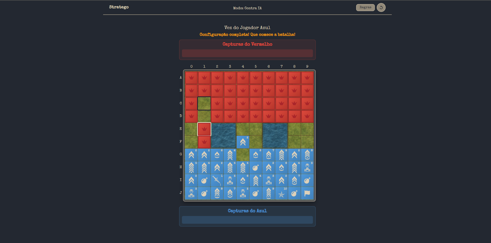

# Stratego Game / EN

My first hands-on React project: a complete digital recreation of the classic Stratego board game, integrating Firebase for real-time multiplayer functionality. This was DEFINETELY a real challenge and I'm glad with the result. For sure there are a lot to enhance, but for now it's just amazing to see it trough.

Links

- Play Now: https://fredericwithc.github.io/stratego-game/
- Repository: https://github.com/fredericwithc/stratego-game

About

This project represents my introduction to React development through building a fully functional Stratego game. As my first practical React application, I chose to tackle a complex challenge: implementing intricate game logic, managing multi-layered state across different game phases, and creating an AI opponent from scratch.
The development process involved wrestling with React's component architecture, learning state management patterns in real-time, and solving problems like piece validation, combat resolution, and turn-based gameplay synchronization. Beyond the code, I designed all game assets with the help of AI and some svg assets using Adobe Photoshop and Illustrator, creating the scenario, working with custom military rank insignias and game pieces that balance authenticity with visual clarity.
What started as a learning exercise evolved into a complete game with multiple modes, real-time multiplayer capabilities via Firebase, and an adaptive AI system. This project served as both a crash course in React fundamentals and an exploration of game development patterns in a web environment.

Features

- Full Stratego game rules implementation
- Two-player gameplay
- Piece movement validation
- Battle system with rank hierarchy
- Custom-designed game pieces
- Firebase integration for multiplayer (if applicable)
- Responsive game board

Technologies

- React
- JavaScript
- CSS3
- Firebase
- Adobe Photoshop (game assets)
- Adobe Illustrator (game assets)

Key Learnings

- React component architecture
- Complex game state management
- React hooks (useState, useEffect, useContext)
- Game logic implementation
- Firebase real-time database integration
- Creating and optimizing game assets

Game Modes

- Local 2-Player: Pass-and-play on the same device
- vs AI: Play against computer opponent with adaptive strategies
- Online Multiplayer: Real-time games via Firebase

How to Play

1. Choose your game mode
2. Place your pieces on your side of the board (rows A-D or G-J)
3. Take turns moving pieces and engaging in battles
4. Capture the enemy flag to win
For detailed rules, click the Rules button in-game.

Contact

Frederic Leyenberger

- Linkedin: https://www.linkedin.com/in/frederic-leyenberger/

------------------------------------------------------------------------------------------------

# Jogo de Stratego (ou Combate) / PT-BR

Meu primeiro projeto prático em React: uma recriação digital completa do clássico jogo de tabuleiro Stratego (ou Combate na versão brasileira), integrando o Firebase para funcionalidade multiplayer em tempo real. Foi DEFINITIVAMENTE um grande desafio e estou muito satisfeito com o resultado. Ainda tenho muito o que aprimorar, mas por enquanto já é incrível ver tudo funcionando.

Links

- Jogar Agora: https://fredericwithc.github.io/stratego-game/
- Repositório: https://github.com/fredericwithc/stratego-game

Sobre

Esse projeto representa minha introdução ao desenvolvimento em React através da construção de um jogo completo de Stratego (loucura? provavelmente, mas deu certo kkk). Como meu primeiro aplicativo prático em React, decidi encarar um desafio complexo: implementar a lógica detalhada do jogo, gerenciar múltiplos estados entre diferentes fases e criar uma IA do zero.
O processo de desenvolvimento envolveu aprender a lidar com a arquitetura de componentes do React, padrões de gerenciamento de estado em tempo real e resolver problemas como validação de movimentos, resolução de combates e sincronização de turnos. Além do código, também criei todos os assets visuais com a ajuda de IA e alguns SVGs usando Adobe Photoshop e Illustrator, criando o cenário, trabalhando com as insígnias militares personalizadas e peças de jogo que equilibram autenticidade e clareza visual.
O que começou como um exercício de aprendizado evoluiu para um jogo completo, com múltiplos modos, multiplayer online em tempo real via Firebase e um sistema de IA adaptativa. Esse projeto serviu tanto como um curso intensivo em fundamentos de React quanto como uma exploração de padrões de desenvolvimento de jogos no ambiente web.

Funcionalidades

- Implementação completa das regras do Stratego
- Modo para dois jogadores
- Validação de movimentos das peças
- Sistema de batalhas com hierarquia de patentes
- Peças do jogo e tabuleiro personalizados
- Integração com Firebase para multiplayer Online
- Tabuleiro responsivo

Tecnologias

- React
- JavaScript
- CSS3
- Firebase
- Adobe Photoshop (assets do jogo)
- Adobe Illustrator (assets do jogo)

Principais Aprendizados

- Arquitetura de componentes no React
- Gerenciamento de estados complexos
- Hooks do React (useState, useEffect, useContext)
- Implementação de lógica de jogos
- Integração com banco de dados em tempo real do Firebase
- Criação e otimização de assets visuais

Modos de Jogo

- 2 Jogadores Locais: jogar no mesmo dispositivo
- Contra IA: jogar contra o computador com estratégias adaptativas
- Multiplayer Online: partidas em tempo real via Firebase

Como Jogar

1. Escolha o modo de jogo
2. Posicione suas peças no seu lado do tabuleiro (linhas A-D ou G-J)
3. Revezem os turnos movendo as peças e entrando em batalhas
4. Capture a bandeira inimiga para vencer
Para regras detalhadas, clique no botão de Regras dentro do jogo.

Contato

Frederic Leyenberger

- Linkedin: https://www.linkedin.com/in/frederic-leyenberger/
